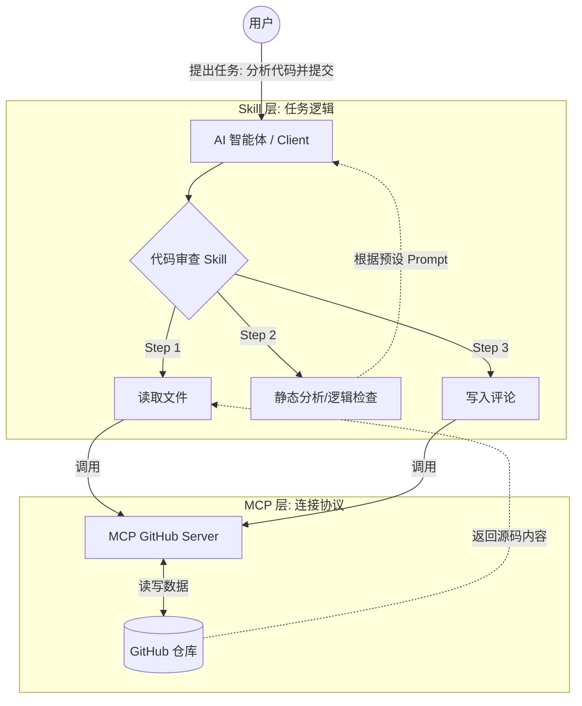

### MCP和Skill    

MCP 是“手和眼睛”（连接硬件/数据），而 Skill 是“教程或菜谱”（操作规程）

| **维度**   | **MCP (Model Context Protocol)** | **Skill (技能)**                     |
| ---------- | -------------------------------- | ------------------------------------ |
| **性质**   | 基础设施/通信协议 (Protocol)     | 任务逻辑/操作流程 (Workflow)         |
| **关注点** | **“我能连上什么？”** (连接力)    | **“我该怎么做？”** (执行力)          |
| **复杂度** | 原子化、功能导向 (读、写、算)    | 复合型、目标导向 (部署、调试、总结)  |
| **数据流** | 建立 AI 到外部世界的管道         | 编排 AI 内部的思考步骤               |
| **例子**   | 一个连接 PostgreSQL 数据库的接口 | 一个“分析数据库性能并生成周报”的流程 |

示意图：

### 规范：