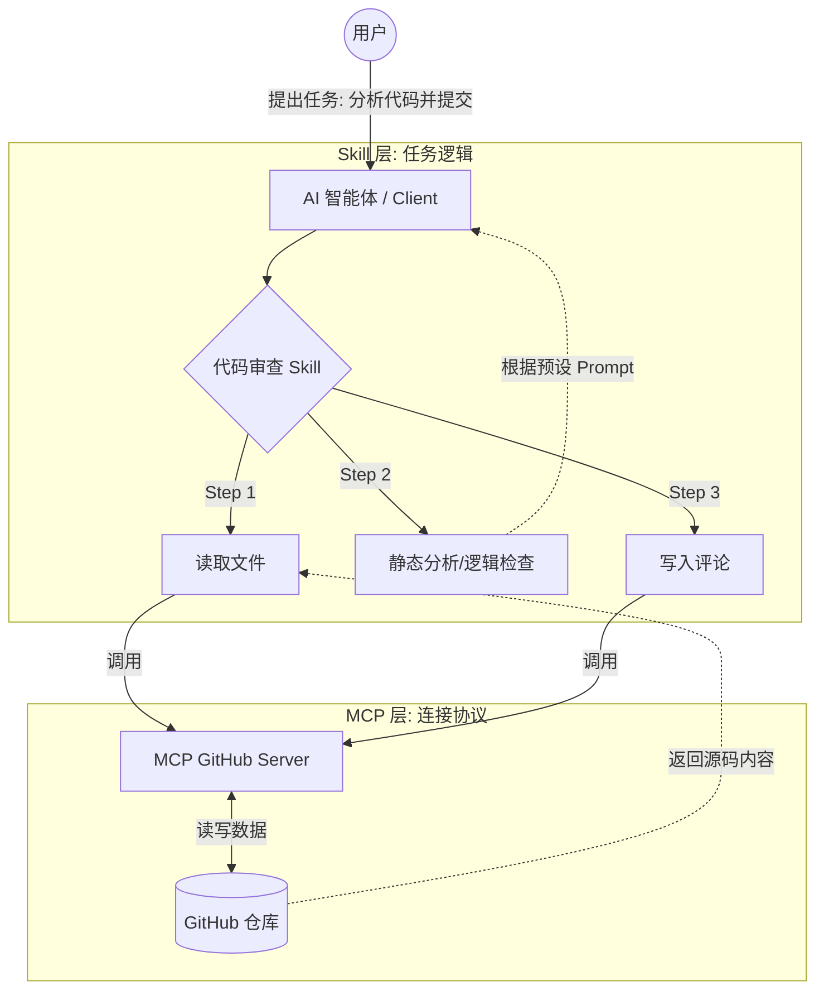

### MCP和Skill    

MCP 是“手和眼睛”（连接硬件/数据），而 Skill 是“教程或菜谱”（操作规程）

| **维度**   | **MCP (Model Context Protocol)** | **Skill (技能)**                     |
| ---------- | -------------------------------- | ------------------------------------ |
| **性质**   | 基础设施/通信协议 (Protocol)     | 任务逻辑/操作流程 (Workflow)         |
| **关注点** | **“我能连上什么？”** (连接力)    | **“我该怎么做？”** (执行力)          |
| **复杂度** | 原子化、功能导向 (读、写、算)    | 复合型、目标导向 (部署、调试、总结)  |
| **数据流** | 建立 AI 到外部世界的管道         | 编排 AI 内部的思考步骤               |
| **例子**   | 一个连接 PostgreSQL 数据库的接口 | 一个“分析数据库性能并生成周报”的流程 |

个人建议：**找合适的mcp或者自己写mcp，然后把使用封装成skill，来供项目使用**

示意图：


```mermaid
graph TD
    User((用户)) -->|提出任务: 分析代码并提交| AI[AI 智能体 / Client]
    
    subgraph Skill_Layer [Skill 层: 任务逻辑]
        AI --> Skill{代码审查 Skill}
        Skill -->|Step 1| Task1[读取文件]
        Skill -->|Step 2| Task2[静态分析/逻辑检查]
        Skill -->|Step 3| Task3[写入评论]
    end

    subgraph MCP_Layer [MCP 层: 连接协议]
        Task1 -->|调用| MCP_Server[MCP GitHub Server]
        Task3 -->|调用| MCP_Server
        MCP_Server <-->|读写数据| Repo[(GitHub 仓库)]
    end

    Task2 -.->|根据预设 Prompt| AI
    Repo -.->|返回源码内容| Task1
```

### MCP推荐 

我是在vs code中添加配置，先安装cline，然后搜索安装mcp，你也可以在cursor中配置，配置文件格式相同

GitHub：操作github

Browser Tools: https://github.com/AgentDeskAI/browser-tools-mcp

   安装chrome插件，server列表配置npx方式，然后执行npx命令， 就可以分析浏览器组件

```
npx @agentdeskai/browser-tools-server@latest
```

文件系统：操作本地文件

Playright: 来自微软，方便控制浏览器 https://github.com/lackeyjb/playwright-skill

Fetch：网页抓取，解析 

Apple或map_windows：便于和系统应用交互，可以写邮件，发短信，记日记

HotNew： 热搜新闻聚合

remotion：Remotion 视频创建

**[openai/sora](https://github.com/openai/skills/tree/main/skills/.curated/sora)** - Generate, remix, and manage short video clips via OpenAI's Sora API

还有数据库的mcp，高德mcp等


### MCP资源

腾讯云插件中心，百度MCP 广场,  阿里魔搭社区MCP广场


### Skill推荐

https://github.com/VoltAgent/awesome-agent-skills
