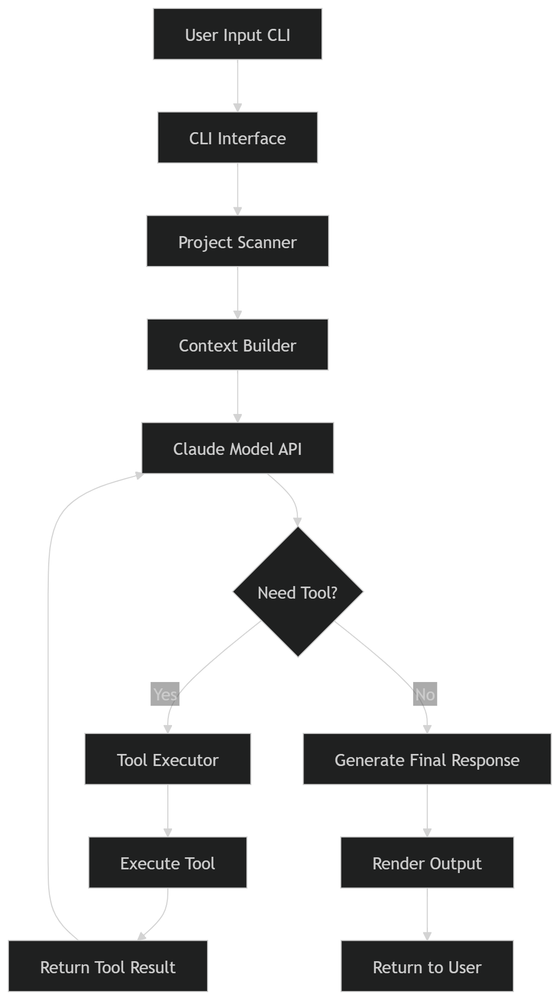
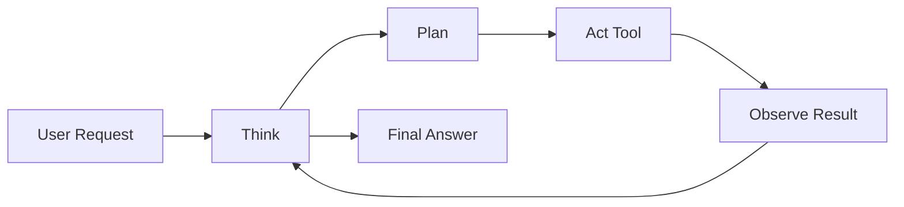

## ClaudeCode工作流程

用户输入 → Prompt构建 → LLM推理 → 工具调用 → 执行 → 结果反馈 → 继续推理 → 输出结果

### 完整架构图



### 内部 Agent Loop




## Hooks

Hooks 是一种**自动化机制**。它允许你定义一系列规则，当特定的“事件”（Event）发生时，系统会自动在你的终端执行预设的 Shell 命令。

#### 核心配置说明： 

通过 /hooks 命令 或者配置文件

1. **配置文件路径**：通常位于用户根目录下的 `.claude/config.json`。
2. **触发时机（常见事件类型）**

```
{  //示例
  "hooks": {
    "onToolCall": {
      "Edit": "echo '文件被修改' >> changelog.txt"
    },
    "onUserSubmit": "npm run lint",
    "onSessionStart": "git fetch origin",
    "onBeforeCommit": "npm test"
  }
}
```

### Hook 事件

| 事件类型               | 触发时机         | 典型用途           |
| :--------------------- | :--------------- | :----------------- |
| **user-prompt-submit** | 用户提交提示词前 | 验证、修改提示词   |
| **tool-use**           | 工具使用前       | 权限检查、参数验证 |
| **after-tool-use**     | 工具使用后       | 日志记录、结果处理 |
| **permission-request** | 权限请求时       | 拦截危险操作       |
| **notification**       | 通知时           | 发送告警、更新状态 |

```
{
  "hooks": {
    "task-complete-hook": {
      "command": "notify-send 'Claude Code' '任务已完成'",
      "enabled": true
    }
  }
}
```

###  Hook 处理程序字段

内部 `hooks` 数组中的每个对象都是一个 hook 处理程序：当匹配器匹配时运行的 shell 命令、HTTP 端点、LLM 提示或代理。

- **[命令 hooks](https://code.claude.com/docs/zh-CN/hooks#command-hook-fields)**（`type: "command"`）：运行 shell 命令。您的脚本在 stdin 上接收事件的 [JSON 输入](https://code.claude.com/docs/zh-CN/hooks#hook-input-and-output)，并通过退出代码和 stdout 传回结果。
- **[HTTP hooks](https://code.claude.com/docs/zh-CN/hooks#http-hook-fields)**（`type: "http"`）：将事件的 JSON 输入作为 HTTP POST 请求发送到 URL。端点通过使用与命令 hooks 相同的 [JSON 输出格式](https://code.claude.com/docs/zh-CN/hooks#json-output) 的响应体传回结果。
- **[提示 hooks](https://code.claude.com/docs/zh-CN/hooks#prompt-and-agent-hook-fields)**（`type: "prompt"`）：向 Claude 模型发送提示以进行单轮评估。模型返回 yes/no 决定作为 JSON。请参阅 [基于提示的 hooks](https://code.claude.com/docs/zh-CN/hooks#prompt-based-hooks)。
- **[代理 hooks](https://code.claude.com/docs/zh-CN/hooks#prompt-and-agent-hook-fields)**（`type: "agent"`）：生成一个可以使用 Read、Grep 和 Glob 等工具来验证条件的 subagent，然后返回决定。请参阅 [基于代理的 hooks](https://code.claude.com/docs/zh-CN/hooks#agent-based-hooks)。

### Skills 和代理中的 Hooks

除了设置文件和插件外，hooks 还可以使用 frontmatter 直接在 [skills](https://code.claude.com/docs/zh-CN/skills) 和 [subagents](https://code.claude.com/docs/zh-CN/sub-agents) 中定义。这些 hooks 的范围限于组件的生命周期，仅在该组件活跃时运行。

### 基于提示的 Hooks

除了命令和 HTTP hooks，Claude Code 还支持基于提示的 hooks（`type: "prompt"`），使用 LLM 来评估是否允许或阻止操作，以及代理 hooks（`type: "agent"`），生成一个可以使用 Read、Grep 和 Glob 等工具来验证条件的 agentic 验证器。并非所有事件都支持每种 hook 类型。


## 常用提示词

```
仔细阅读 /xxx 的代码，撰写一个详细的架构分析文档，如需图表，使用 mermaid chart。
文档放在：doc/xxxx-by-claude.md
```


## Agents Teams模式(待完善)


## 安全

### 排除敏感文件

要防止 Claude Code 访问包含敏感信息（如 API 密钥、secrets 和环境文件）的文件，请在您的 `.claude/settings.json` 文件中使用 `permissions.deny` 设置：

```
{
  "permissions": {
    "deny": [
      "Read(./.env)",
      "Read(./.env.*)",
      "Read(./secrets/**)",
      "Read(./config/credentials.json)",
      "Read(./build)"
    ]
  }
}
```


## 技巧总结

总结：

1.代码任务用Sonnet模型，推理用Opus；2.大任务拆分阶段处理；3.精简上下文文件，避免node_modules等大文件；4.长代码采用流式分段生成；5.定期新开会话避免token累积；6.直接要求"给结果不要推理"减少hidden token消耗。掌握这些可显著降低限额触发概率。
