# Codex 架构分析文档

> 基于源代码分析，撰写于 2026-03-07

---

## 目录

1. [项目概述](#1-项目概述)
2. [仓库结构](#2-仓库结构)
3. [高层架构](#3-高层架构)
4. [核心模块详解](#4-核心模块详解)
   - 4.1 [入口层 (Entry Layer)](#41-入口层)
   - 4.2 [TUI 层](#42-tui-层)
   - 4.3 [App Server 层](#43-app-server-层)
   - 4.4 [Core Agent 层](#44-core-agent-层)
   - 4.5 [工具执行层 (Tools & Exec)](#45-工具执行层)
   - 4.6 [沙箱安全层 (Sandboxing)](#46-沙箱安全层)
   - 4.7 [持久化层 (State & Rollout)](#47-持久化层)
   - 4.8 [插件与 MCP 层](#48-插件与-mcp-层)
5. [数据流分析](#5-数据流分析)
   - 5.1 [交互式会话流](#51-交互式会话流)
   - 5.2 [工具调用流](#52-工具调用流)
   - 5.3 [审批/授权流](#53-审批授权流)
6. [协议与序列化](#6-协议与序列化)
7. [配置系统](#7-配置系统)
8. [安全架构](#8-安全架构)
9. [外部集成](#9-外部集成)
10. [Rust Crate 依赖图](#10-rust-crate-依赖图)
11. [关键设计模式](#11-关键设计模式)
12. [构建与发布](#12-构建与发布)
13. [测试架构](#13-测试架构)
14. [TypeScript SDK](#14-typescript-sdk)
15. [架构总结与评价](#15-架构总结与评价)

---

## 1. 项目概述

**Codex** 是 OpenAI 开发的本地 AI 编程 Agent 系统。它将大型语言模型（LLM）的推理能力与本地代码执行、文件操作、Shell 命令执行紧密结合，形成一个完整的代码生成与修改 Agent。

核心特性：
- 交互式 TUI（终端用户界面）以及非交互式批量执行模式
- 多平台沙箱隔离（macOS Seatbelt、Linux Landlock+seccomp、Windows 受限令牌）
- 支持 Model Context Protocol (MCP) 的工具扩展生态
- 会话录制、恢复与 fork
- 插件（Skills）系统
- 流式 LLM 响应处理

技术栈：
| 层级 | 技术 |
|------|------|
| 核心逻辑 | Rust (异步，tokio) |
| CLI 分发 | Node.js (npm wrapper) |
| TUI | ratatui + crossterm |
| 序列化 | serde_json / JSONL |
| 构建 | Bazel + Cargo |
| 包管理 | pnpm (monorepo) |

---

## 2. 仓库结构

```
codex/
├── codex-cli/              # Node.js CLI 分发包（平台检测 + Rust 进程启动）
│   ├── bin/codex.js        # 主可执行文件
│   ├── package.json
│   └── vendor/             # 各平台预编译 Rust 二进制
│
├── codex-rs/               # 主体 Rust 工作区（60+ crate）
│   ├── cli/                # CLI 主入口 (clap)
│   ├── core/               # Agent 核心引擎
│   ├── tui/                # 终端 UI
│   ├── app-server/         # WebSocket/stdio 服务端（v2 协议）
│   ├── protocol/           # 类型定义与协议结构
│   ├── exec/               # 命令执行框架
│   ├── skills/             # 插件/技能系统
│   ├── mcp-server/         # MCP 服务器实现
│   ├── config/             # 配置管理
│   ├── login/              # 认证
│   ├── chatgpt/            # OpenAI API 集成
│   ├── backend-client/     # HTTP 后端客户端
│   ├── file-search/        # 文件搜索
│   ├── state/              # 会话状态 (SQLite)
│   ├── shell-command/      # Shell 指令解析
│   ├── execpolicy/         # 执行策略/安全策略
│   ├── sandboxing/         # 沙箱实现
│   ├── rollout/            # 会话录制与持久化
│   └── utils/              # 15+ 工具 crate
│
├── sdk/typescript/         # TypeScript SDK
│   └── src/
│       ├── codex.ts        # 主 SDK 客户端
│       ├── exec.ts         # 执行工具
│       ├── thread.ts       # 线程/会话管理
│       └── items.ts        # 协议数据类型
│
├── shell-tool-mcp/         # Shell 命令 MCP Server
├── docs/                   # 文档（25+ Markdown）
├── pnpm-workspace.yaml     # Monorepo 工作区定义
├── Cargo.toml              # Rust 工作区配置
├── MODULE.bazel            # Bazel 依赖管理
└── justfile                # 开发辅助命令
```

---

## 3. 高层架构

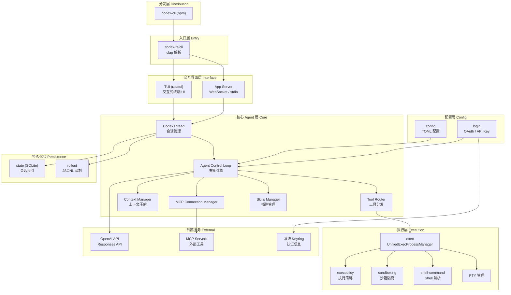
```mermaid
graph TB
    subgraph "分发层 Distribution"
        NPM["codex-cli (npm)"]
    end

    subgraph "入口层 Entry"
        CLI["codex-rs/cli<br/>clap 解析"]
    end

    subgraph "交互界面层 Interface"
        TUI["TUI (ratatui)<br/>交互式终端 UI"]
        APPSRV["App Server<br/>WebSocket / stdio"]
    end

    subgraph "核心 Agent 层 Core"
        THREAD["CodexThread<br/>会话管理"]
        CTRL["Agent Control Loop<br/>决策引擎"]
        TOOLS["Tool Router<br/>工具分发"]
        CTX["Context Manager<br/>上下文压缩"]
        MCP_MGR["MCP Connection Manager"]
        SKILLS_MGR["Skills Manager<br/>插件管理"]
    end

    subgraph "执行层 Execution"
        EXEC["exec<br/>UnifiedExecProcessManager"]
        POLICY["execpolicy<br/>执行策略"]
        SANDBOX["sandboxing<br/>沙箱隔离"]
        SHELL["shell-command<br/>Shell 解析"]
        PTY["PTY 管理"]
    end

    subgraph "持久化层 Persistence"
        STATE["state (SQLite)<br/>会话索引"]
        ROLLOUT["rollout<br/>JSONL 录制"]
    end

    subgraph "外部服务 External"
        OPENAI["OpenAI API<br/>Responses API"]
        MCP_EXT["MCP Servers<br/>外部工具"]
        KEYRING["系统 Keyring<br/>认证信息"]
    end

    subgraph "配置层 Config"
        CONFIG["config<br/>TOML 配置"]
        LOGIN["login<br/>OAuth / API Key"]
    end

    NPM --> CLI
    CLI --> TUI
    CLI --> APPSRV
    TUI --> THREAD
    APPSRV --> THREAD
    THREAD --> CTRL
    CTRL --> TOOLS
    CTRL --> CTX
    CTRL --> MCP_MGR
    CTRL --> SKILLS_MGR
    TOOLS --> EXEC
    EXEC --> POLICY
    EXEC --> SANDBOX
    EXEC --> SHELL
    EXEC --> PTY
    THREAD --> ROLLOUT
    THREAD --> STATE
    CTRL --> OPENAI
    MCP_MGR --> MCP_EXT
    LOGIN --> KEYRING
    CONFIG --> CTRL
    LOGIN --> CTRL
```

---

## 4. 核心模块详解

### 4.1 入口层

#### `codex-cli/bin/codex.js`
Node.js 轻量包装器，唯一职责是**平台检测与进程启动**：

```javascript
// 逻辑流程
1. 检测 platform (linux/darwin/win32) + arch (x64/arm64)
2. 从 vendor/ 找到对应平台的预编译 Rust 二进制
3. spawn() 子进程，透传所有参数
4. 转发 SIGINT/SIGTERM 信号
5. 镜像子进程退出码
```

#### `codex-rs/cli/src/main.rs`

使用 `clap` 定义 `MultitoolCli` 结构，提供以下子命令：

| 子命令 | 别名 | 功能 |
|--------|------|------|
| (默认) | — | 启动交互式 TUI |
| `exec` | `e` | 非交互式执行 |
| `review` | — | 代码审查模式 |
| `login` / `logout` | — | 账户认证 |
| `mcp` | — | MCP 服务器管理 |
| `app-server` | — | App Server 模式 |
| `sandbox` | — | 沙箱操作 |
| `resume` / `fork` | — | 会话管理 |
| `apply` | `a` | 应用差异 |
| `cloud` | — | 云端任务 |
| `features` | — | Feature Flag 查看 |

---

### 4.2 TUI 层

`codex-rs/tui/src/` 基于 **ratatui** 框架构建交互式 TUI：

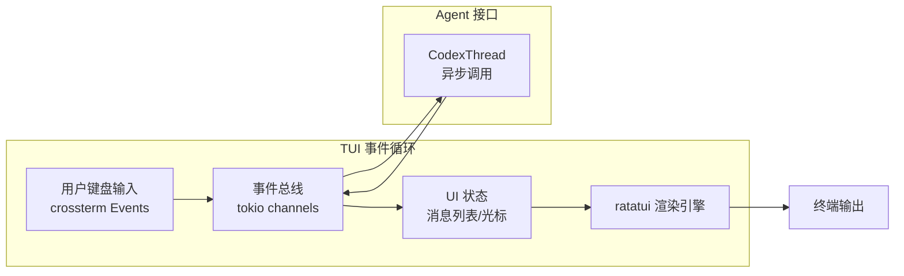
```mermaid
graph LR
    subgraph "TUI 事件循环"
        INPUT["用户键盘输入<br/>crossterm Events"]
        RENDER["ratatui 渲染引擎"]
        STATE_TUI["UI 状态<br/>消息列表/光标"]
        EVENT_BUS["事件总线<br/>tokio channels"]
    end

    INPUT --> EVENT_BUS
    EVENT_BUS --> STATE_TUI
    STATE_TUI --> RENDER
    RENDER --> TERMINAL["终端输出"]

    subgraph "Agent 接口"
        CODEX_THREAD["CodexThread<br/>异步调用"]
    end

    EVENT_BUS --> CODEX_THREAD
    CODEX_THREAD --> EVENT_BUS
```

关键特性：
- 异步渲染，非阻塞 I/O（tokio）
- 支持流式 LLM 输出实时显示
- 审批对话框（工具调用确认）
- 可选语音输入（feature flag）
- 消息历史滚动浏览

---

### 4.3 App Server 层

`codex-rs/app-server/` 提供基于 WebSocket 或 stdio 的 JSON-RPC 服务端，供外部客户端（如 IDE 插件）接入：

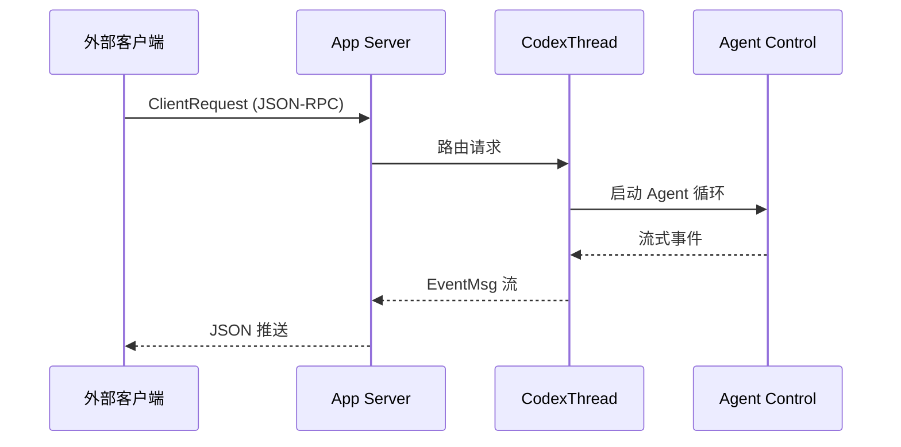
```mermaid
sequenceDiagram
    participant Client as 外部客户端
    participant AppSrv as App Server
    participant Thread as CodexThread
    participant Agent as Agent Control

    Client->>AppSrv: ClientRequest (JSON-RPC)
    AppSrv->>Thread: 路由请求
    Thread->>Agent: 启动 Agent 循环
    Agent-->>Thread: 流式事件
    Thread-->>AppSrv: EventMsg 流
    AppSrv-->>Client: JSON 推送
```

支持两种传输层：
- **WebSocket**: 远程客户端
- **stdio**: 进程间通信（IPC）

---

### 4.4 Core Agent 层

`codex-rs/core/` 是整个系统最复杂的部分（主文件 codex.rs 超过 2MB）。

#### 核心类型关系

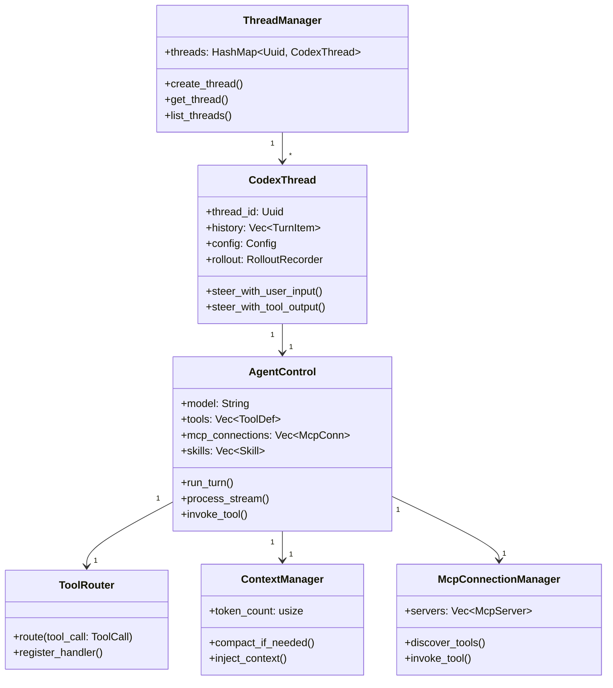
```mermaid
classDiagram
    class CodexThread {
        +thread_id: Uuid
        +history: Vec~TurnItem~
        +config: Config
        +rollout: RolloutRecorder
        +steer_with_user_input()
        +steer_with_tool_output()
    }

    class ThreadManager {
        +threads: HashMap~Uuid, CodexThread~
        +create_thread()
        +get_thread()
        +list_threads()
    }

    class AgentControl {
        +model: String
        +tools: Vec~ToolDef~
        +mcp_connections: Vec~McpConn~
        +skills: Vec~Skill~
        +run_turn()
        +process_stream()
        +invoke_tool()
    }

    class ToolRouter {
        +route(tool_call: ToolCall)
        +register_handler()
    }

    class ContextManager {
        +token_count: usize
        +compact_if_needed()
        +inject_context()
    }

    class McpConnectionManager {
        +servers: Vec~McpServer~
        +discover_tools()
        +invoke_tool()
    }

    ThreadManager "1" --> "*" CodexThread
    CodexThread "1" --> "1" AgentControl
    AgentControl "1" --> "1" ToolRouter
    AgentControl "1" --> "1" ContextManager
    AgentControl "1" --> "1" McpConnectionManager
```

#### Agent Control Loop 核心流程

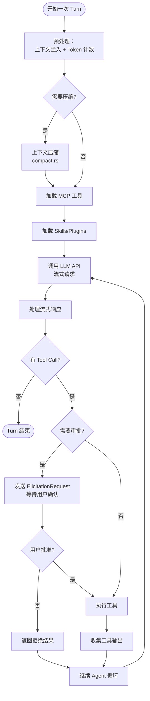
```mermaid
flowchart TD
    START(["开始一次 Turn"]) --> PREPROCESS["预处理：<br/>上下文注入 + Token 计数"]
    PREPROCESS --> COMPACT{"需要压缩?"}
    COMPACT -->|是| COMPACTION["上下文压缩<br/>compact.rs"]
    COMPACT -->|否| MCP_LOAD["加载 MCP 工具"]
    COMPACTION --> MCP_LOAD
    MCP_LOAD --> SKILLS_LOAD["加载 Skills/Plugins"]
    SKILLS_LOAD --> LLM_CALL["调用 LLM API<br/>流式请求"]
    LLM_CALL --> STREAM_PROCESS["处理流式响应"]
    STREAM_PROCESS --> TOOL_CALL{"有 Tool Call?"}
    TOOL_CALL -->|否| DONE(["Turn 结束"])
    TOOL_CALL -->|是| APPROVAL{"需要审批?"}
    APPROVAL -->|是| ELICIT["发送 ElicitationRequest<br/>等待用户确认"]
    APPROVAL -->|否| EXEC_TOOL["执行工具"]
    ELICIT --> USER_RESP{"用户批准?"}
    USER_RESP -->|否| REJECT["返回拒绝结果"]
    USER_RESP -->|是| EXEC_TOOL
    REJECT --> CONTINUE
    EXEC_TOOL --> TOOL_RESULT["收集工具输出"]
    TOOL_RESULT --> CONTINUE["继续 Agent 循环"]
    CONTINUE --> LLM_CALL
```

---

### 4.5 工具执行层

`codex-rs/exec/` 提供统一的进程执行框架：

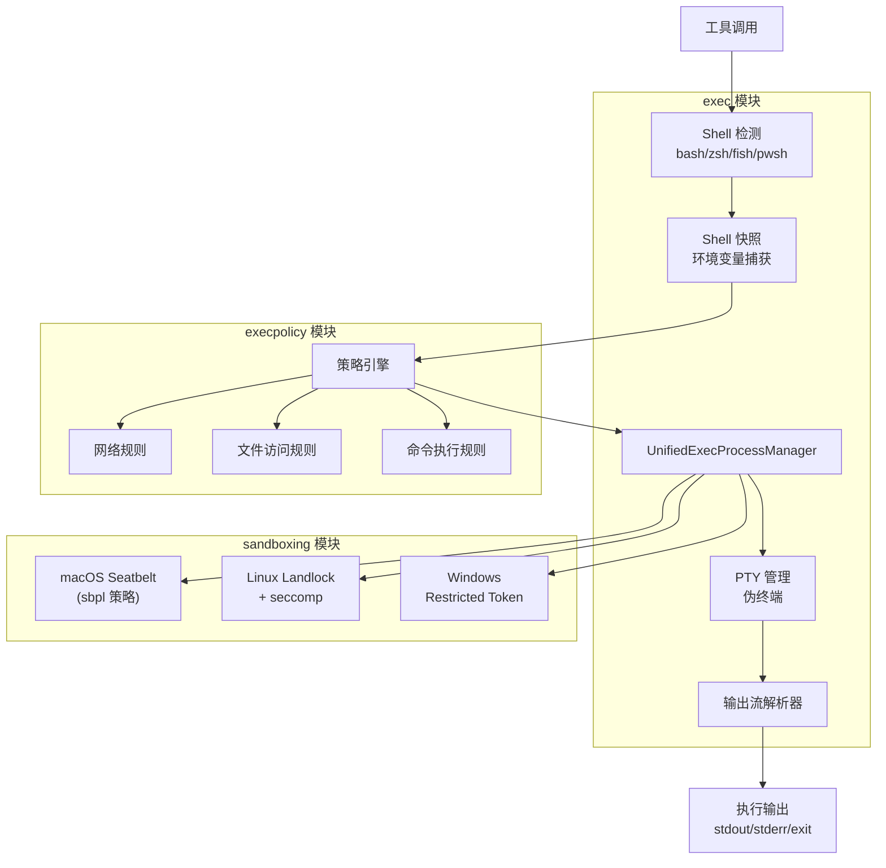
```mermaid
graph TB
    subgraph "exec 模块"
        UNIFIED["UnifiedExecProcessManager"]
        SHELL_DETECT["Shell 检测<br/>bash/zsh/fish/pwsh"]
        SNAP["Shell 快照<br/>环境变量捕获"]
        PTY_MGR["PTY 管理<br/>伪终端"]
        STREAM_PARSE["输出流解析器"]
    end

    subgraph "execpolicy 模块"
        POLICY_ENGINE["策略引擎"]
        NETWORK_RULE["网络规则"]
        FILE_RULE["文件访问规则"]
        EXEC_RULE["命令执行规则"]
    end

    subgraph "sandboxing 模块"
        SEATBELT["macOS Seatbelt<br/>(sbpl 策略)"]
        LANDLOCK["Linux Landlock<br/>+ seccomp"]
        WIN_SB["Windows<br/>Restricted Token"]
    end

    TOOL_CALL["工具调用"] --> SHELL_DETECT
    SHELL_DETECT --> SNAP
    SNAP --> POLICY_ENGINE
    POLICY_ENGINE --> NETWORK_RULE
    POLICY_ENGINE --> FILE_RULE
    POLICY_ENGINE --> EXEC_RULE
    POLICY_ENGINE --> UNIFIED
    UNIFIED --> PTY_MGR
    UNIFIED --> SEATBELT
    UNIFIED --> LANDLOCK
    UNIFIED --> WIN_SB
    PTY_MGR --> STREAM_PARSE
    STREAM_PARSE --> OUTPUT["执行输出<br/>stdout/stderr/exit"]
```

#### 执行策略配置

```toml
# 沙箱权限配置示例
[sandbox]
network = "disabled"          # disabled | read-only | full
write_policy = "prompt"       # auto-deny | prompt | auto-allow
```

---

### 4.6 沙箱安全层

平台相关的隔离实现：

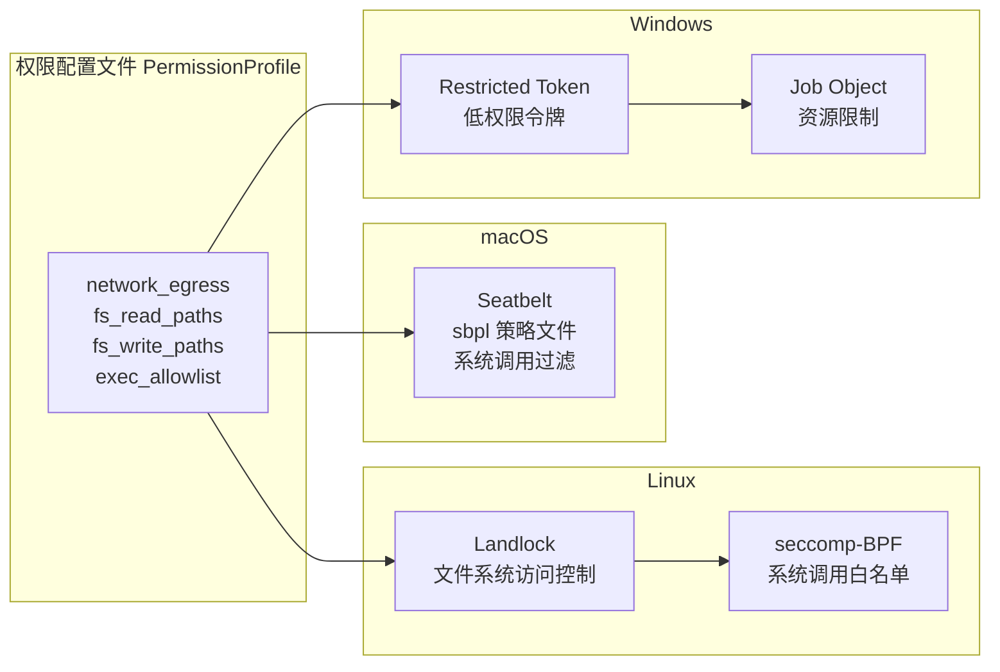
```mermaid
graph LR
    subgraph "macOS"
        SEATBELT_IMPL["Seatbelt<br/>sbpl 策略文件<br/>系统调用过滤"]
    end

    subgraph "Linux"
        LANDLOCK_IMPL["Landlock<br/>文件系统访问控制"]
        SECCOMP_IMPL["seccomp-BPF<br/>系统调用白名单"]
        LANDLOCK_IMPL --> SECCOMP_IMPL
    end

    subgraph "Windows"
        RESTRICTED["Restricted Token<br/>低权限令牌"]
        JOB["Job Object<br/>资源限制"]
        RESTRICTED --> JOB
    end

    subgraph "权限配置文件 PermissionProfile"
        PERM["network_egress<br/>fs_read_paths<br/>fs_write_paths<br/>exec_allowlist"]
    end

    PERM --> SEATBELT_IMPL
    PERM --> LANDLOCK_IMPL
    PERM --> RESTRICTED
```

---

### 4.7 持久化层

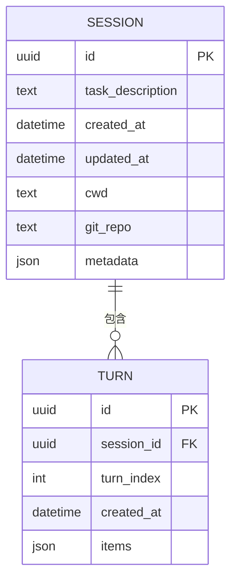
```mermaid
erDiagram
    SESSION {
        uuid id PK
        text task_description
        datetime created_at
        datetime updated_at
        text cwd
        text git_repo
        json metadata
    }

    TURN {
        uuid id PK
        uuid session_id FK
        int turn_index
        datetime created_at
        json items
    }

    SESSION ||--o{ TURN : "包含"
```

- **state (SQLite)**：会话元数据索引，支持快速检索
- **rollout (JSONL)**：每个 Turn 的完整 Item 序列，追加写入，支持重放
- **存储位置**：`~/.codex/sessions/`

---

### 4.8 插件与 MCP 层

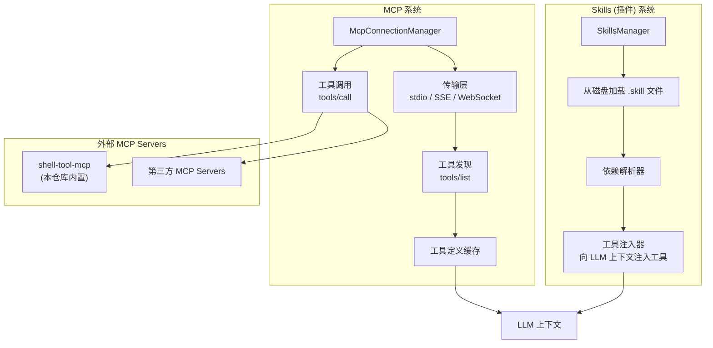
```mermaid
graph TB
    subgraph "Skills (插件) 系统"
        SKILLS_MANAGER["SkillsManager"]
        SKILL_LOADER["从磁盘加载 .skill 文件"]
        DEP_RESOLVER["依赖解析器"]
        TOOL_INJECTOR["工具注入器<br/>向 LLM 上下文注入工具"]
    end

    subgraph "MCP 系统"
        MCP_CONN_MGR["McpConnectionManager"]
        MCP_TRANSPORT["传输层<br/>stdio / SSE / WebSocket"]
        MCP_DISCOVERY["工具发现<br/>tools/list"]
        MCP_INVOKE["工具调用<br/>tools/call"]
        TOOL_CACHE["工具定义缓存"]
    end

    subgraph "外部 MCP Servers"
        SHELL_MCP["shell-tool-mcp<br/>(本仓库内置)"]
        EXT_MCP["第三方 MCP Servers"]
    end

    SKILLS_MANAGER --> SKILL_LOADER
    SKILL_LOADER --> DEP_RESOLVER
    DEP_RESOLVER --> TOOL_INJECTOR
    TOOL_INJECTOR --> LLM_CTX["LLM 上下文"]

    MCP_CONN_MGR --> MCP_TRANSPORT
    MCP_TRANSPORT --> MCP_DISCOVERY
    MCP_DISCOVERY --> TOOL_CACHE
    TOOL_CACHE --> LLM_CTX
    MCP_CONN_MGR --> MCP_INVOKE
    MCP_INVOKE --> SHELL_MCP
    MCP_INVOKE --> EXT_MCP
```

---

## 5. 数据流分析

### 5.1 交互式会话流

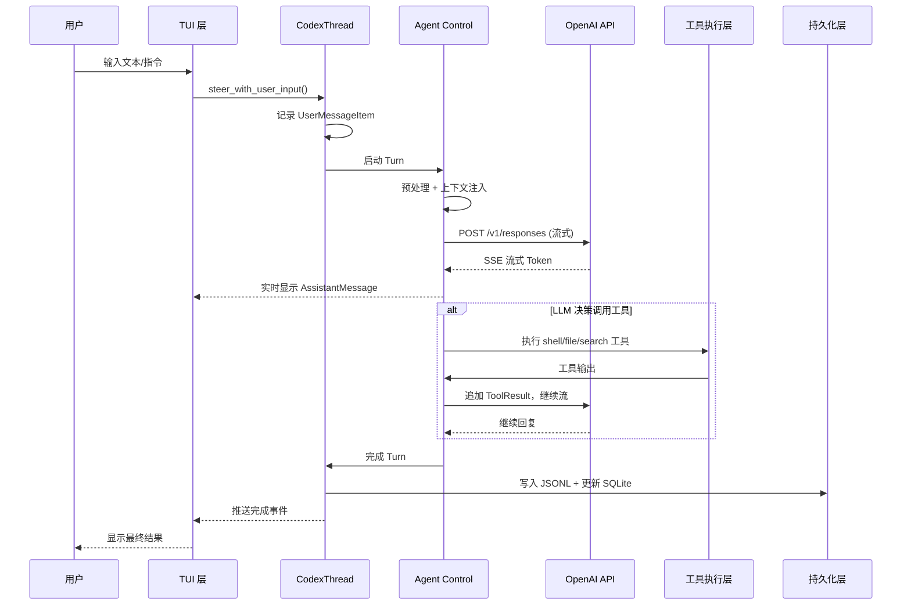
```mermaid
sequenceDiagram
    participant User as 用户
    participant TUI as TUI 层
    participant Thread as CodexThread
    participant Agent as Agent Control
    participant LLM as OpenAI API
    participant Tools as 工具执行层
    participant Persist as 持久化层

    User->>TUI: 输入文本/指令
    TUI->>Thread: steer_with_user_input()
    Thread->>Thread: 记录 UserMessageItem
    Thread->>Agent: 启动 Turn
    Agent->>Agent: 预处理 + 上下文注入
    Agent->>LLM: POST /v1/responses (流式)
    LLM-->>Agent: SSE 流式 Token
    Agent-->>TUI: 实时显示 AssistantMessage
    alt LLM 决策调用工具
        Agent->>Tools: 执行 shell/file/search 工具
        Tools->>Agent: 工具输出
        Agent->>LLM: 追加 ToolResult，继续流
        LLM-->>Agent: 继续回复
    end
    Agent->>Thread: 完成 Turn
    Thread->>Persist: 写入 JSONL + 更新 SQLite
    Thread-->>TUI: 推送完成事件
    TUI-->>User: 显示最终结果
```

### 5.2 工具调用流

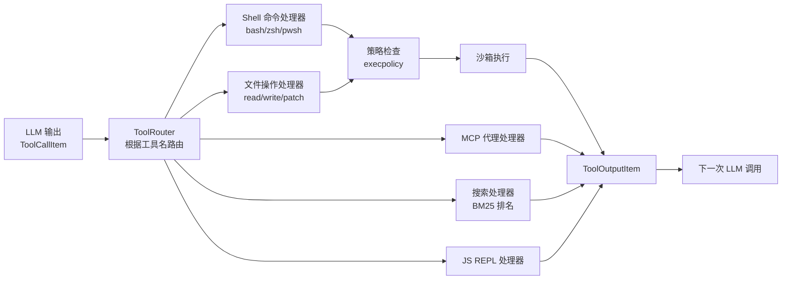
```mermaid
flowchart LR
    LLM_OUTPUT["LLM 输出<br/>ToolCallItem"] --> ROUTER["ToolRouter<br/>根据工具名路由"]

    ROUTER --> SHELL_HANDLER["Shell 命令处理器<br/>bash/zsh/pwsh"]
    ROUTER --> FILE_HANDLER["文件操作处理器<br/>read/write/patch"]
    ROUTER --> SEARCH_HANDLER["搜索处理器<br/>BM25 排名"]
    ROUTER --> MCP_HANDLER["MCP 代理处理器"]
    ROUTER --> REPL_HANDLER["JS REPL 处理器"]

    SHELL_HANDLER --> POLICY_CHECK["策略检查<br/>execpolicy"]
    FILE_HANDLER --> POLICY_CHECK
    POLICY_CHECK --> SANDBOX["沙箱执行"]
    SANDBOX --> RESULT["ToolOutputItem"]
    MCP_HANDLER --> RESULT
    SEARCH_HANDLER --> RESULT
    REPL_HANDLER --> RESULT

    RESULT --> LLM_NEXT["下一次 LLM 调用"]
```

### 5.3 审批/授权流

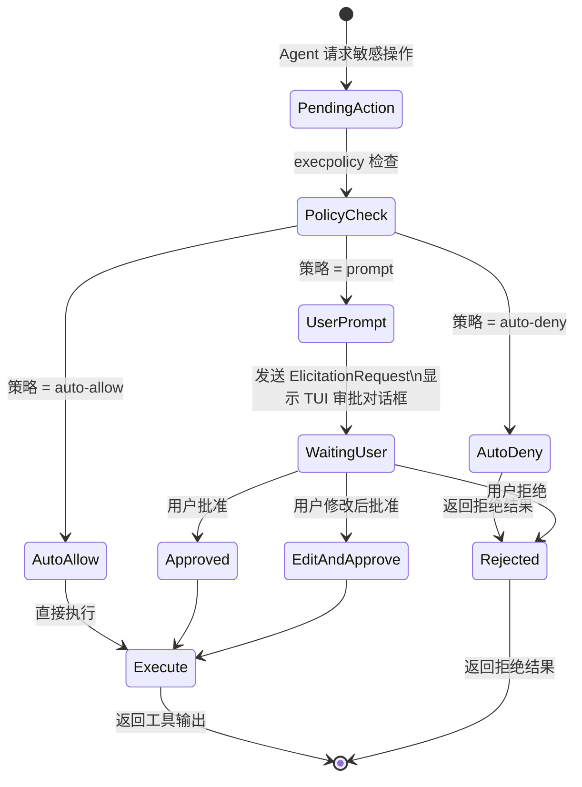
```mermaid
stateDiagram-v2
    [*] --> PendingAction: Agent 请求敏感操作

    PendingAction --> PolicyCheck: execpolicy 检查

    PolicyCheck --> AutoAllow: 策略 = auto-allow
    PolicyCheck --> AutoDeny: 策略 = auto-deny
    PolicyCheck --> UserPrompt: 策略 = prompt

    AutoAllow --> Execute: 直接执行
    AutoDeny --> Rejected: 返回拒绝结果

    UserPrompt --> WaitingUser: 发送 ElicitationRequest\n显示 TUI 审批对话框
    WaitingUser --> Approved: 用户批准
    WaitingUser --> Rejected: 用户拒绝
    WaitingUser --> EditAndApprove: 用户修改后批准

    Approved --> Execute
    EditAndApprove --> Execute
    Execute --> [*]: 返回工具输出
    Rejected --> [*]: 返回拒绝结果
```

---

## 6. 协议与序列化

### Event / Item 类型层次

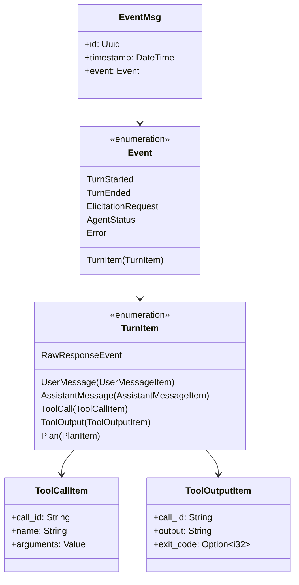
```mermaid
classDiagram
    class EventMsg {
        +id: Uuid
        +timestamp: DateTime
        +event: Event
    }

    class Event {
        <<enumeration>>
        TurnStarted
        TurnEnded
        TurnItem(TurnItem)
        ElicitationRequest
        AgentStatus
        Error
    }

    class TurnItem {
        <<enumeration>>
        UserMessage(UserMessageItem)
        AssistantMessage(AssistantMessageItem)
        ToolCall(ToolCallItem)
        ToolOutput(ToolOutputItem)
        Plan(PlanItem)
        RawResponseEvent
    }

    class ToolCallItem {
        +call_id: String
        +name: String
        +arguments: Value
    }

    class ToolOutputItem {
        +call_id: String
        +output: String
        +exit_code: Option~i32~
    }

    EventMsg --> Event
    Event --> TurnItem
    TurnItem --> ToolCallItem
    TurnItem --> ToolOutputItem
```

### 序列化策略
- 运行时通信：**JSON** via serde_json
- 持久化存储：**JSONL**（每行一个 EventMsg）
- TypeScript 绑定：**ts-rs** 自动生成（`.d.ts` 文件）
- Config 文件：**TOML** (config/types.rs → Config 结构)

---

## 7. 配置系统

### 配置层次（优先级由低到高）

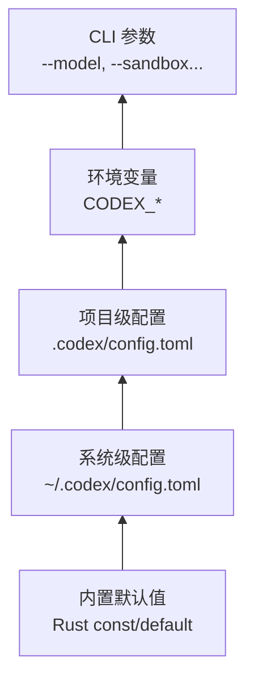
```mermaid
graph BT
    BUILTIN["内置默认值<br/>Rust const/default"]
    SYSTEM["系统级配置<br/>~/.codex/config.toml"]
    PROJECT["项目级配置<br/>.codex/config.toml"]
    ENV["环境变量<br/>CODEX_*"]
    CLI_FLAGS["CLI 参数<br/>--model, --sandbox..."]

    BUILTIN --> SYSTEM
    SYSTEM --> PROJECT
    PROJECT --> ENV
    ENV --> CLI_FLAGS
```

### 配置结构

```toml
# ~/.codex/config.toml 示例
[auth]
api_key = "sk-..."

[models]
default = "gpt-4o"
reasoning = "o3-mini"

[sandbox]
network = "disabled"
write_policy = "prompt"

[mcp]
servers = [
  { name = "shell", command = "codex-shell-mcp" }
]

[skills]
paths = ["~/.codex/skills/"]

[tui]
theme = "dark"
```

---

## 8. 安全架构

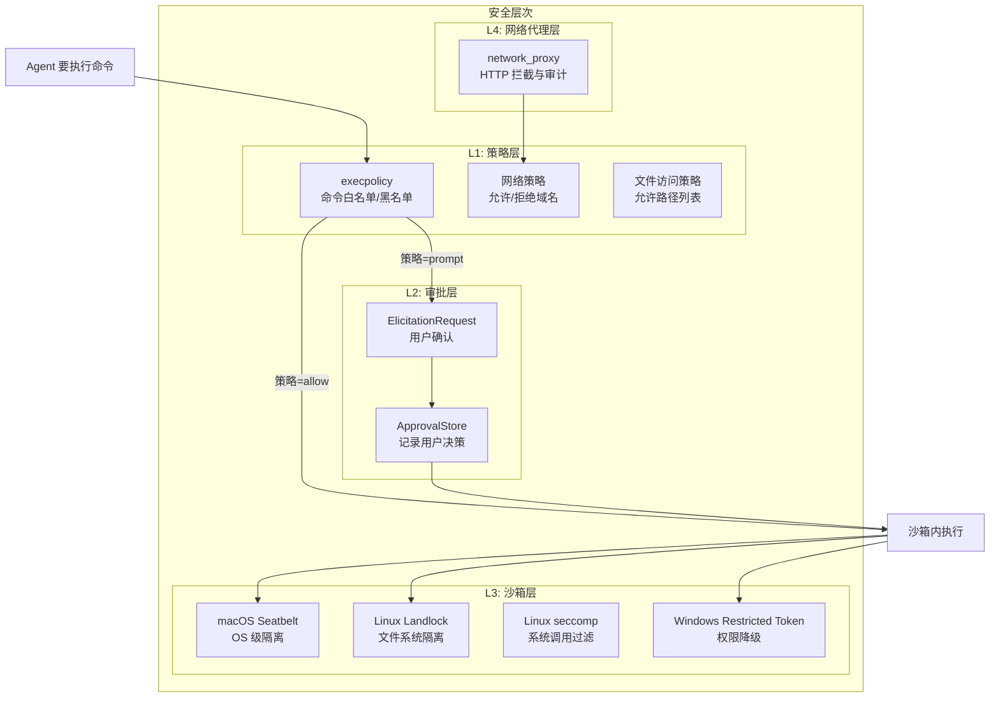
```mermaid
graph TB
    subgraph "安全层次"
        subgraph "L1: 策略层"
            EXEC_POLICY["execpolicy<br/>命令白名单/黑名单"]
            NET_POLICY["网络策略<br/>允许/拒绝域名"]
            FILE_POLICY["文件访问策略<br/>允许路径列表"]
        end

        subgraph "L2: 审批层"
            ELICIT["ElicitationRequest<br/>用户确认"]
            APPROVAL_STORE["ApprovalStore<br/>记录用户决策"]
        end

        subgraph "L3: 沙箱层"
            SEATBELT["macOS Seatbelt<br/>OS 级隔离"]
            LANDLOCK["Linux Landlock<br/>文件系统隔离"]
            SECCOMP["Linux seccomp<br/>系统调用过滤"]
            WIN_RESTRICTED["Windows Restricted Token<br/>权限降级"]
        end

        subgraph "L4: 网络代理层"
            NET_PROXY["network_proxy<br/>HTTP 拦截与审计"]
        end
    end

    USER_CMD["Agent 要执行命令"] --> EXEC_POLICY
    EXEC_POLICY -->|"策略=prompt"| ELICIT
    EXEC_POLICY -->|"策略=allow"| SANDBOX_EXEC
    ELICIT --> APPROVAL_STORE
    APPROVAL_STORE --> SANDBOX_EXEC

    SANDBOX_EXEC["沙箱内执行"] --> SEATBELT
    SANDBOX_EXEC --> LANDLOCK
    SANDBOX_EXEC --> WIN_RESTRICTED

    NET_PROXY --> NET_POLICY
```

三层防御纵深：
1. **策略层**：命令级别的白名单/黑名单规则
2. **审批层**：人在环路（Human-in-the-Loop）的确认机制
3. **沙箱层**：OS 级隔离，即使策略被绕过也有最后防线

---

## 9. 外部集成

### 集成关系图

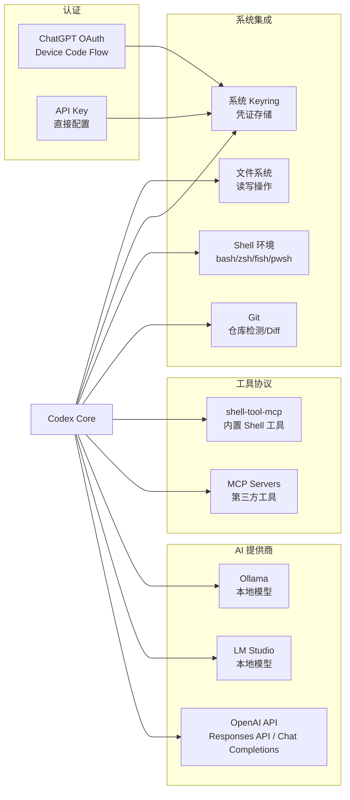
```mermaid
graph LR
    CODEX["Codex Core"]

    subgraph "AI 提供商"
        OPENAI_API["OpenAI API<br/>Responses API / Chat Completions"]
        LMSTUDIO["LM Studio<br/>本地模型"]
        OLLAMA["Ollama<br/>本地模型"]
    end

    subgraph "工具协议"
        MCP_SERVERS["MCP Servers<br/>第三方工具"]
        SHELL_MCP["shell-tool-mcp<br/>内置 Shell 工具"]
    end

    subgraph "系统集成"
        GIT["Git<br/>仓库检测/Diff"]
        SHELL_ENV["Shell 环境<br/>bash/zsh/fish/pwsh"]
        KEYRING["系统 Keyring<br/>凭证存储"]
        FILESYSTEM["文件系统<br/>读写操作"]
    end

    subgraph "认证"
        CHATGPT_AUTH["ChatGPT OAuth<br/>Device Code Flow"]
        API_KEY["API Key<br/>直接配置"]
    end

    CODEX --> OPENAI_API
    CODEX --> LMSTUDIO
    CODEX --> OLLAMA
    CODEX --> MCP_SERVERS
    CODEX --> SHELL_MCP
    CODEX --> GIT
    CODEX --> SHELL_ENV
    CODEX --> KEYRING
    CODEX --> FILESYSTEM
    CHATGPT_AUTH --> KEYRING
    API_KEY --> KEYRING
```

---

## 10. Rust Crate 依赖图

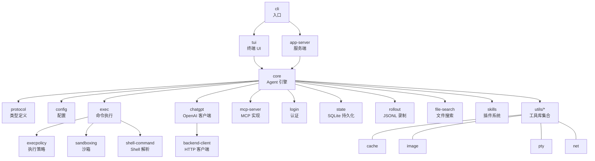
```mermaid
graph TD
    CLI["cli<br/>入口"] --> TUI["tui<br/>终端 UI"]
    CLI --> APPSRV["app-server<br/>服务端"]

    TUI --> CORE["core<br/>Agent 引擎"]
    APPSRV --> CORE

    CORE --> PROTOCOL["protocol<br/>类型定义"]
    CORE --> CONFIG["config<br/>配置"]
    CORE --> EXEC["exec<br/>命令执行"]
    CORE --> CHATGPT["chatgpt<br/>OpenAI 客户端"]
    CORE --> MCP_SRV["mcp-server<br/>MCP 实现"]
    CORE --> LOGIN["login<br/>认证"]
    CORE --> STATE["state<br/>SQLite 持久化"]
    CORE --> ROLLOUT["rollout<br/>JSONL 录制"]
    CORE --> FILE_SEARCH["file-search<br/>文件搜索"]
    CORE --> SKILLS["skills<br/>插件系统"]

    EXEC --> EXECPOLICY["execpolicy<br/>执行策略"]
    EXEC --> SANDBOXING["sandboxing<br/>沙箱"]
    EXEC --> SHELL_CMD["shell-command<br/>Shell 解析"]

    CHATGPT --> BACKEND_CLIENT["backend-client<br/>HTTP 客户端"]

    CORE --> UTILS["utils/*<br/>工具库集合"]
    UTILS --- CACHE["cache"]
    UTILS --- IMAGE_UTILS["image"]
    UTILS --- PTY_UTILS["pty"]
    UTILS --- NET_UTILS["net"]
```

### 主要第三方依赖

| 依赖 | 用途 |
|------|------|
| `tokio` | 异步运行时 |
| `serde` / `serde_json` | 序列化/反序列化 |
| `reqwest` | HTTP 客户端（OpenAI API 调用）|
| `ratatui` | TUI 框架 |
| `crossterm` | 跨平台终端控制 |
| `clap` | CLI 参数解析 |
| `rmcp` | MCP 协议 Rust SDK |
| `sqlx` | 异步 SQLite（会话状态）|
| `tracing` | 结构化日志/追踪 |
| `wiremock` | 测试用 HTTP Mock |
| `insta` | Snapshot 测试 |

---

## 11. 关键设计模式

### 11.1 事件驱动架构 (Event-Driven)

所有 Agent 输出通过 `EventMsg` + tokio channel 流式传播，消费者（TUI、App Server、测试）统一订阅：

```rust
// 简化示意
pub struct EventMsg {
    pub event: Event,
    pub metadata: Metadata,
}
// tokio::sync::mpsc::Sender<EventMsg> 传递给 TUI
```

### 11.2 分层架构 (Layered)

```
CLI 分发层 → 交互界面层 → Core Agent 层 → 执行/持久化层
```

每层只依赖下层接口，不跨层访问。

### 11.3 策略模式 (Strategy Pattern)

沙箱实现依赖系统特性注入，三个平台实现同一 `Sandbox` trait：
- `SeatbeltSandbox` (macOS)
- `LandlockSandbox` (Linux)
- `WindowsRestrictedSandbox` (Windows)

### 11.4 命令模式 (Command Pattern)

工具调用封装为 `ToolCallItem`，统一通过 `ToolRouter` 分发，支持动态注册。

### 11.5 观察者模式 (Observer Pattern)

`CodexThread` 通过 channel 向多个消费者广播事件（TUI、App Server、录制器）。

### 11.6 插件模式 (Plugin Architecture)

Skills 和 MCP 工具在运行时动态加载，向 LLM 上下文注入工具定义，不修改核心代码。

### 11.7 流式处理 (Streaming)

LLM 响应通过 SSE（Server-Sent Events）流式接收，实时处理每个 Token，减少首字延迟。

---

## 12. 构建与发布

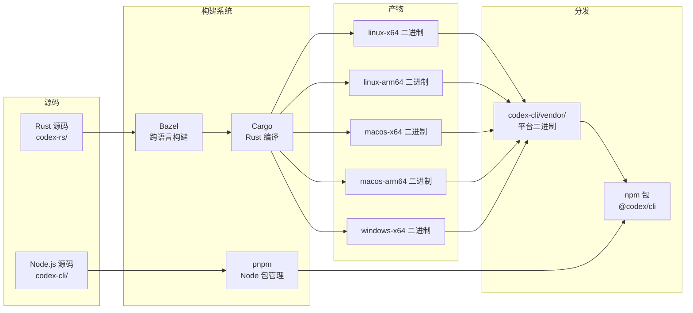
```mermaid
graph LR
    subgraph "源码"
        RUST_SRC["Rust 源码<br/>codex-rs/"]
        NODE_SRC["Node.js 源码<br/>codex-cli/"]
    end

    subgraph "构建系统"
        BAZEL["Bazel<br/>跨语言构建"]
        CARGO["Cargo<br/>Rust 编译"]
        PNPM["pnpm<br/>Node 包管理"]
    end

    subgraph "产物"
        LINUX_X64["linux-x64 二进制"]
        LINUX_ARM["linux-arm64 二进制"]
        MACOS_X64["macos-x64 二进制"]
        MACOS_ARM["macos-arm64 二进制"]
        WIN_X64["windows-x64 二进制"]
    end

    subgraph "分发"
        NPM_PKG["npm 包<br/>@codex/cli"]
        VENDOR["codex-cli/vendor/<br/>平台二进制"]
    end

    RUST_SRC --> BAZEL
    NODE_SRC --> PNPM
    BAZEL --> CARGO
    CARGO --> LINUX_X64
    CARGO --> LINUX_ARM
    CARGO --> MACOS_X64
    CARGO --> MACOS_ARM
    CARGO --> WIN_X64

    LINUX_X64 --> VENDOR
    LINUX_ARM --> VENDOR
    MACOS_X64 --> VENDOR
    MACOS_ARM --> VENDOR
    WIN_X64 --> VENDOR
    VENDOR --> NPM_PKG
    PNPM --> NPM_PKG
```

Linux 目标使用 **musl** 静态链接，实现零依赖部署。

---

## 13. 测试架构

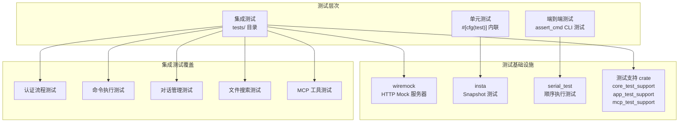
```mermaid
graph TB
    subgraph "测试层次"
        UNIT["单元测试<br/>#[cfg(test)] 内联"]
        INTEG["集成测试<br/>tests/ 目录"]
        E2E["端到端测试<br/>assert_cmd CLI 测试"]
    end

    subgraph "测试基础设施"
        MOCK_SERVER["wiremock<br/>HTTP Mock 服务器"]
        SNAP_TEST["insta<br/>Snapshot 测试"]
        SERIAL["serial_test<br/>顺序执行测试"]
        TEST_SUPPORT["测试支持 crate<br/>core_test_support<br/>app_test_support<br/>mcp_test_support"]
    end

    subgraph "集成测试覆盖"
        AUTH_TEST["认证流程测试"]
        CMD_TEST["命令执行测试"]
        CONV_TEST["对话管理测试"]
        SEARCH_TEST["文件搜索测试"]
        MCP_TEST["MCP 工具测试"]
    end

    INTEG --> AUTH_TEST
    INTEG --> CMD_TEST
    INTEG --> CONV_TEST
    INTEG --> SEARCH_TEST
    INTEG --> MCP_TEST

    INTEG --> MOCK_SERVER
    INTEG --> TEST_SUPPORT
    UNIT --> SNAP_TEST
    E2E --> SERIAL
```

测试文件路径规律：
- 单元测试：与源码同文件 `mod tests { ... }`
- 集成测试：`codex-rs/<crate>/tests/suite/`
- 公共工具：`codex-rs/<crate>/tests/common/`

---

## 14. TypeScript SDK

`sdk/typescript/` 提供对 App Server 协议的高层封装：

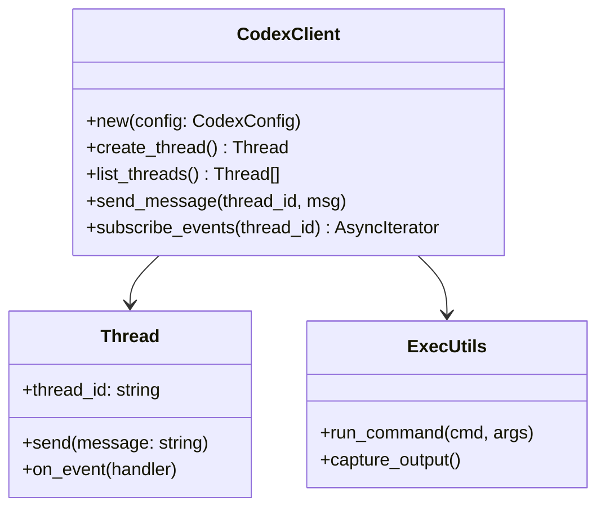
```mermaid
classDiagram
    class CodexClient {
        +new(config: CodexConfig)
        +create_thread() Thread
        +list_threads() Thread[]
        +send_message(thread_id, msg)
        +subscribe_events(thread_id) AsyncIterator
    }

    class Thread {
        +thread_id: string
        +send(message: string)
        +on_event(handler)
    }

    class ExecUtils {
        +run_command(cmd, args)
        +capture_output()
    }

    CodexClient --> Thread
    CodexClient --> ExecUtils
```

SDK 通过 ts-rs 自动生成与 Rust 结构体对应的 TypeScript 类型定义，保证类型一致性。

---

## 15. 架构总结与评价

### 优点

| 方面 | 描述 |
|------|------|
| **安全纵深** | 三层防御（策略→审批→沙箱），跨平台原生实现 |
| **高模块化** | 60+ 独立 crate，关注点明确分离 |
| **可扩展性** | Skills + MCP 双插件机制，无需修改核心 |
| **用户体验** | 流式输出 + 异步 TUI，响应实时 |
| **可观测性** | 全程 JSONL 录制，支持会话重放与恢复 |
| **跨平台** | Linux/macOS/Windows 原生支持，musl 静态链接 |
| **开放标准** | MCP 协议遵循行业标准，生态互操作 |

### 复杂度热点

| 模块 | 复杂度原因 |
|------|-----------|
| `core/codex.rs` | 2MB+ 单文件，整合几乎所有核心逻辑 |
| `protocol/protocol.rs` | 140KB，覆盖所有事件类型 |
| `tui/` | 异步渲染 + 事件驱动 + Agent 集成 |
| `exec/` | 跨平台 PTY + 沙箱 + 策略检查 |

### 潜在改进空间

1. **core/codex.rs 拆分**：主文件过大，可按功能域进一步模块化
2. **协议版本化**：当前协议缺乏显式版本号，升级时可能有兼容性风险
3. **配置 Schema 验证**：TOML 配置缺乏 JSON Schema 支持，难以 IDE 提示

---

*文档由 Claude Sonnet 4.6 基于源代码自动分析生成，生成时间：2026-03-07*
